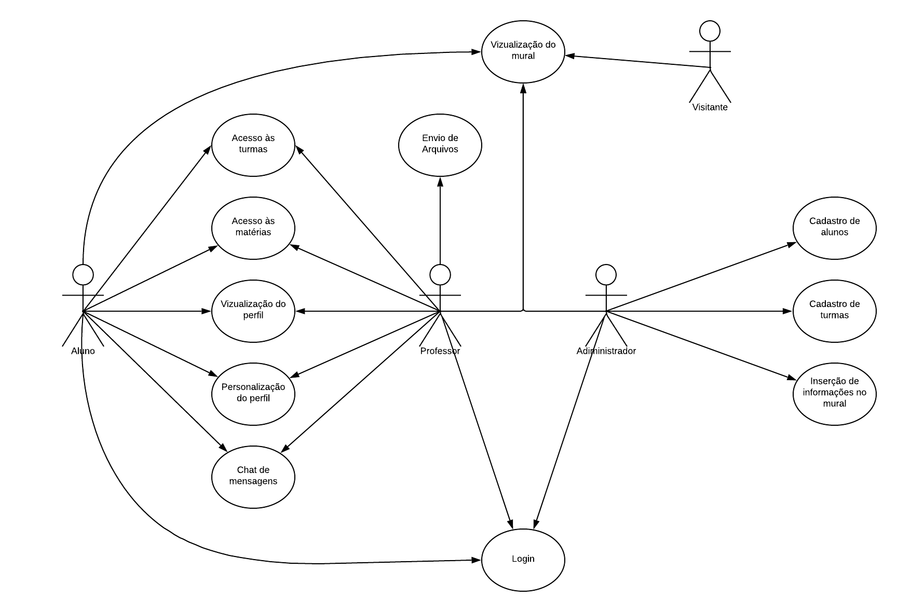
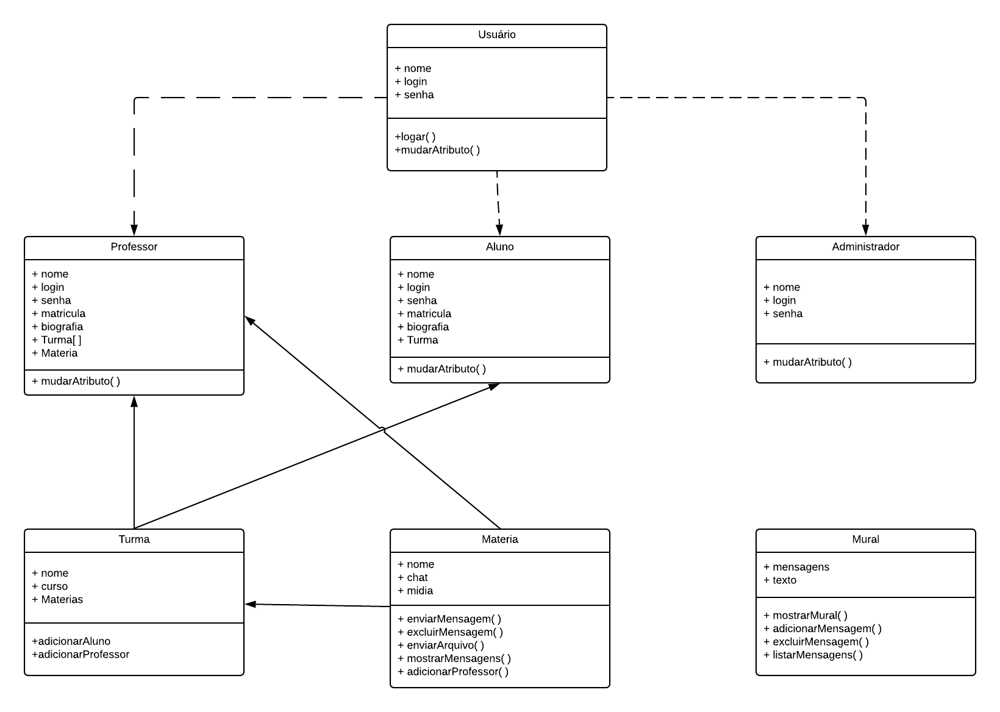

# Plataforma Steacher
Projeto Final do Curso Técnico em Desenvolvimento de Sistemas do Colégio Pedro II – Campus Duque de Caxias – 2019

## Integrantes:
+ Leonardo Henrique Santos Lopes
+ Felipe Silva Melo Bruno
+ Sabrina Cavalcante de Souza
+ Ana Luiza Diniz Fernandes
+ Daniel Moreira dos Passos

## Sumário:
- [Proposta](#proposta)
- [Requisitos](#requisitos)
- [Casos de uso](#casos-de-uso)
- [Modelagem](#modelagem)

### Proposta:
- Criação de um sistema de comunicação discente-doscente ao qual visa facilitar a comunicação entre estas duas entidades.

- Stakeholder: Leandro Almeida

- [proposta.md](doc/proposta.md)

### Requisitos:
- [entrevista.md](doc/entrevista/entrevista.md)
- [entrevista.mp3](doc/entrevista/entrevista.mp3)
- [requisitos.md](doc/requisitos.md)

### Casos de uso:

- [casos_de_uso.md](doc/cdu/casos_de_uso.md)

### Modelagem
- Diagrama de classes:

